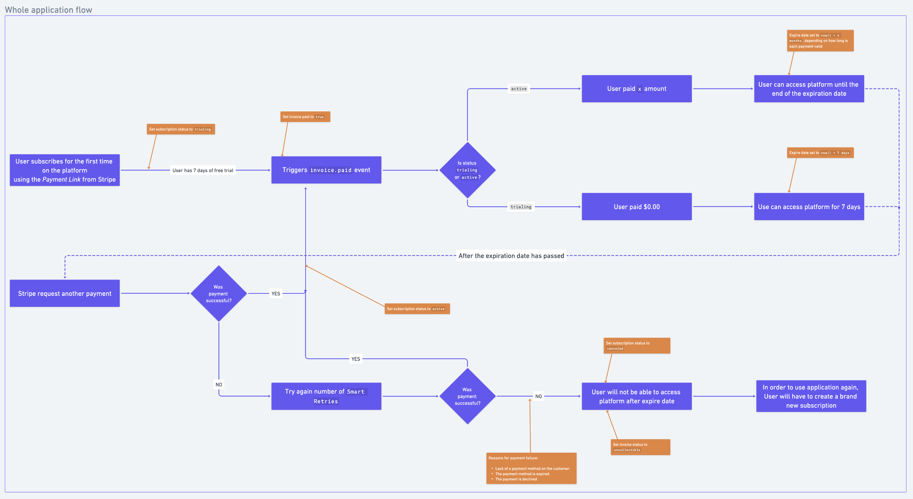

## Stripe CLI

[Install Stripe CLI](https://stripe.com/docs/stripe-cli#install):

```sh
brew install stripe/stripe-cli/stripe
```

Then, run:

```sh
stripe login
```

This will redirect you to the Stripe Dashboard in order to allow the access of the CLI to your application.

## How to run (test mode)

Follow these points:

0) Create an `.env` file:

```sh
cp .env.example .env
```

And then check the [API Keys](#api-keys) and [Webhook Keys](#webhook-key) sections to fill out the environment variables.

1) On a terminal tab, run the server:

```sh
go run .
```

> Server will be running on port :4444

2) On another tab, let Stripe CLI listen to events and do the redirection to your webhook endpoint:

```sh
stripe listen --forward-to localhost:4444/webhook
```

3) Finally, in another one, trigger an event also using Stripe CLI:

```sh
stripe trigger [event_type]
# > stripe trigger customer.created
```

> [Here](https://stripe.com/docs/api/events/types) you can find a list of all Stripe event types.



<p align="center"><i>Flowchart</i></p>

## Misc

### API Keys

The Stripe API keys (public and private) can be found in [here](https://dashboard.stripe.com/test/apikeys), for the test mode, or in [here](https://dashboard.stripe.com/apikeys) for the live mode.

### Webhook key

The webhook key can be found, in test mode, when you run the `stripe listen` command.
For the live mode, you will need to get it at [Developers - Webhook](https://dashboard.stripe.com/test/webhooks).

### Webhooks and subscriptions

When needing to handle subscriptions, [this is the resource](https://stripe.com/docs/billing/subscriptions/webhooks) to follow.

Here are some insights:

[Successful payments](https://stripe.com/docs/billing/subscriptions/overview#successful-payments):
When your customer successfully pays the invoice, the subscription updates to `active` and the invoice to `paid`. At this point, **you can provision access to your product**.

[Payment window](https://stripe.com/docs/billing/subscriptions/overview#payment-window):
Customers have about `23 hours` to make a successful payment. The subscription remains in status `incomplete` and the invoice is `open` during this time. If your customer pays the invoice, the subscription updates to `active` and the invoice to `paid`. If they don’t make a payment, the subscription updates to `incomplete_expired` and the invoice becomes `void`.
This window exists because your customer usually makes the first payment for a subscription while on-session. **If the customer returns to your application after 23 hours, create a new subscription for them.**

[Failed payments](https://stripe.com/docs/billing/subscriptions/overview#failed-payments):
The subscription’s status remains `active` as long as automatic payments succeed. If automatic payment fails, the subscription updates to `past_due` and Stripe attempts to recover payment based on your [retry rules](https://dashboard.stripe.com/settings/billing/automatic). If payment recovery fails, you can set the subscription status to `canceled`, `unpaid`, or leave it `past_due`.

From [Payment Status](https://stripe.com/docs/billing/subscriptions/overview#payment-status):
| PAYMENT OUTCOME | PAYMENTINTENT STATUS | INVOICE STATUS | SUBSCRIPTION STATUS |
| --------------- | -------------------- | --------------- | -------------------- |
|     Success     |     `succeeded`        |    `paid`        |     `active`    |
| Fails because of a card error | `requires_payment_method` | `open` |  `incomplete`  |
| Fails because of authentication |  `requires_action` |  `open` | `incomplete` |

More subscriptions configurations can be found [here](https://dashboard.stripe.com/settings/billing/automatic).
